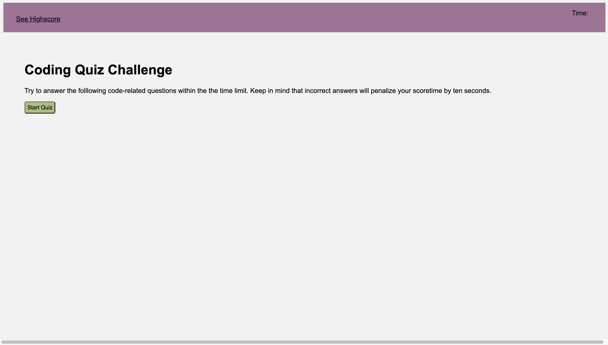
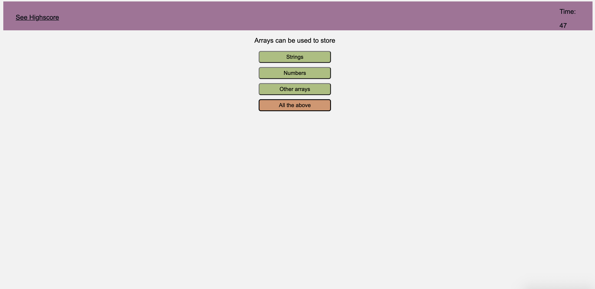
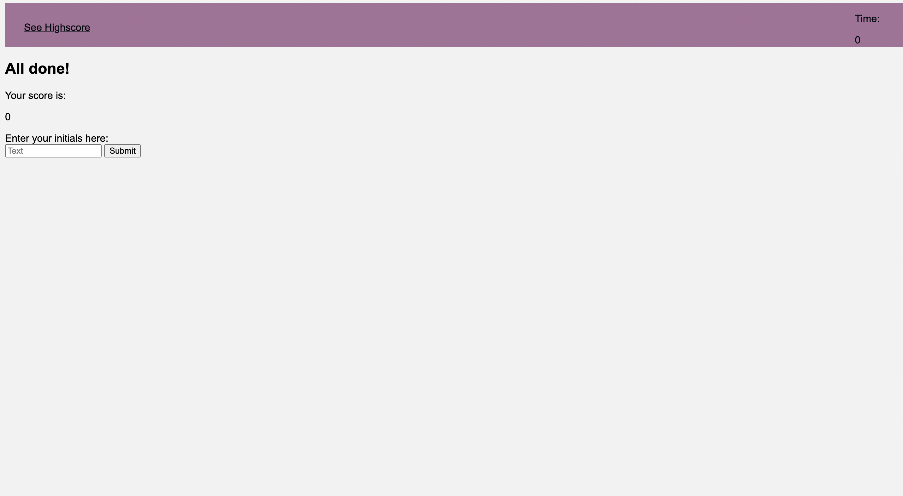

# Code Quiz

## Description

This Code Quiz uses HTML, CSS and JavaScript skills that have been learned in class during the past weeks. The Code Quiz consists of a series of questions about JS fundamentals, it is timed and gives you a score at the end.

## Website Appearance 

## [Published Site](https://dinoabrego.github.io/code-quiz/)

